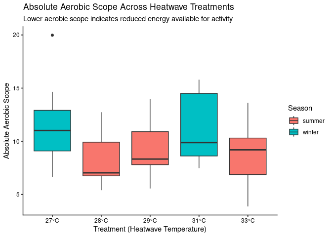
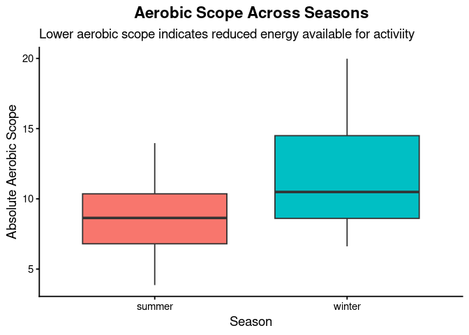
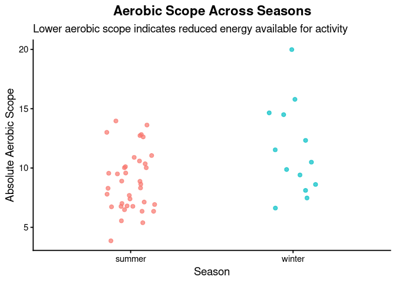

Project memo
================
MMTR

``` r
library(tidyverse)
library(broom)
library(viridisLite)
library(ggplot2)
```

## Data Clean Up Steps for Overall Data

### Step 1: Upload main dataset

``` r
heatwaves_coral_fish <- read_csv("../data/VanWert_etal_2023_hawkfish.csv")
```

    ## Rows: 75 Columns: 22
    ## ── Column specification ────────────────────────────────────────────────────────
    ## Delimiter: ","
    ## chr  (4): season, treatment_new, tank, chase_pre_v_post
    ## dbl (18): hawkfish_no, year, bw_g, tl_cm, sl_cm, mmr_corrected, smr_low10_al...
    ## 
    ## ℹ Use `spec()` to retrieve the full column specification for this data.
    ## ℹ Specify the column types or set `show_col_types = FALSE` to quiet this message.

``` r
glimpse(heatwaves_coral_fish)
```

    ## Rows: 75
    ## Columns: 22
    ## $ hawkfish_no            <dbl> 1, 2, 3, 4, 5, 6, 7, 8, 9, 10, 11, 12, 13, 14, …
    ## $ year                   <dbl> 2019, 2019, 2019, 2019, 2019, 2019, 2019, 2019,…
    ## $ season                 <chr> "winter", "winter", "winter", "winter", "winter…
    ## $ treatment_new          <chr> "31", "31", "31", "27", "27", "27", "27", "31",…
    ## $ bw_g                   <dbl> 6.00, 8.00, 9.00, 6.70, 10.50, 7.00, 4.00, 2.00…
    ## $ tank                   <chr> "S2", "S2", "S3", "S1", "S4", "S5", "S5", "S2",…
    ## $ tl_cm                  <dbl> 7.0, 8.5, 9.0, 7.2, 9.0, 7.1, 6.7, 4.5, 7.4, 5.…
    ## $ sl_cm                  <dbl> 6.1, 7.2, 7.4, 6.2, 7.2, 6.0, 5.9, 3.9, 6.1, 4.…
    ## $ chase_pre_v_post       <chr> "post", "post", "post", "post", "post", "post",…
    ## $ mmr_corrected          <dbl> 12.58, 16.81, 18.32, 13.05, 13.85, 9.48, 16.42,…
    ## $ smr_low10_all          <dbl> 2.71, 2.30, 2.53, NA, 1.52, 1.37, 1.78, NA, 2.1…
    ## $ aas_corrected          <dbl> 9.87, 14.50, 15.79, NA, 12.33, 8.11, 14.65, NA,…
    ## $ fas                    <dbl> 4.64, 7.30, 7.23, NA, 9.09, 6.91, 9.25, NA, 6.3…
    ## $ percent_bw_scallop_fed <dbl> 2, 2, 2, 2, 2, 2, 2, 2, 2, 2, 2, 2, 2, 2, 2, 2,…
    ## $ SDA_integrated         <dbl> 54.86, 48.24, 26.69, 18.58, 31.06, 31.38, 59.89…
    ## $ SDA_duration           <dbl> 31.5, 30.5, 26.5, 28.5, 28.5, 29.5, 34.5, 12.5,…
    ## $ peak_SDA_max           <dbl> 8.51, 5.95, 5.43, 3.07, 4.25, 3.90, 5.03, 9.09,…
    ## $ time_peak_SDA_max      <dbl> 0.0, 14.5, 7.5, 0.0, 15.5, 15.5, 19.5, 5.5, 23.…
    ## $ sda_coeff              <dbl> 1.20, 1.06, 0.59, 0.41, 0.68, 0.69, 1.32, 0.52,…
    ## $ tarr                   <dbl> NA, NA, NA, NA, NA, NA, NA, NA, NA, NA, NA, NA,…
    ## $ fhmax_peak             <dbl> NA, NA, NA, NA, NA, NA, NA, NA, NA, NA, NA, NA,…
    ## $ tpeak                  <dbl> NA, NA, NA, NA, NA, NA, NA, NA, NA, NA, NA, NA,…

### Step 2: Change Variable Names

``` r
heatwaves_coral_fish_clean <- heatwaves_coral_fish |>
  rename(wet_mass = bw_g,
         total_length = tl_cm,
         standard_length = sl_cm,
         max_metabolic_rate = mmr_corrected,
         standard_metabolic_rate = smr_low10_all,
         absolute_aerobic_scope = aas_corrected,
         factorial_aerobic_scope = fas,
         SDA_coeff = sda_coeff,
         temp_of_arrhythmia = tarr,
         peak_max_heart_rate = fhmax_peak,
         temp_at_max_heart_rate = tpeak)
```

## Plots

### Plot 1: Boxplot: Heatwave treatment vs. maximum metabolic rate (MMR), colored by season

``` r
heatwave_vs_mmr <- heatwaves_coral_fish_clean |>
  filter(treatment_new != "wild") |>
  ggplot(aes(x = treatment_new, y = max_metabolic_rate, fill = season)) +
  geom_boxplot(position = position_dodge(width = 0.8)) +
  scale_x_discrete(labels = function(x) paste0(x, "°C")) +
  labs(
    title = "Maximum Metabolic Rate by Heatwave Treatment",
    subtitle = "Fish MMR is lowest at 28°C heatwaves and peaks at 31°C",
    x = "Treatment (Heatwave Temperature)",
    y = "Maximum Metabolic Rate (MMR)",
    fill = "Season"
  ) +
  theme_classic()

# Save the plot
ggsave("fig_mmr_vs_heatwave_boxplot.png", heatwave_vs_mmr, width = 7, height = 5)
```

    ## Warning: Removed 3 rows containing non-finite outside the scale range
    ## (`stat_boxplot()`).

### Plot 2: Scatter Plot: Treatment vs. post-feeding energy use, colored by season

``` r
temp_energy_season <- heatwaves_coral_fish_clean |>
  filter(treatment_new != "wild") |>
  ggplot(aes(x = treatment_new, y = SDA_integrated, color = season)) +
  geom_point(alpha = 0.8, size = 3) +
  scale_x_discrete(labels = function(x) ifelse(x == "wild", "wild", paste0(x, "°C"))) +
  labs(
    title = "Temperature vs. SDA (by Season)",
    subtitle = "Warmer summer temperatures make digestion more energetically costly",
    x = "Temperature Treatment",
    y = "SDA"
  )

# Save the plot
ggsave("fig_temp_energy_season_scatterplot.png", temp_energy_season, width = 7, height = 5)
```

    ## Warning: Removed 12 rows containing missing values or values outside the scale range
    ## (`geom_point()`).

### Plot 3:Time graph, seasonal cycle of metabolic rate

``` r
season_means <- heatwaves_coral_fish_clean |>
  group_by(season) |>
  summarise(mean_mmr = mean(max_metabolic_rate, na.rm = TRUE))


seasonal_cycle <- ggplot(season_means, aes(x = season, y = mean_mmr, group = 1)) +
  geom_line(size = 1.2, color = "blue") +
  geom_point(size = 4, color = "darkred") +
  coord_polar() +
  theme_minimal() +
  labs(
    title = "Seasonal Cycle of Mean Metabolic Rate For Hawkfish",
    x = "",
    y = "Mean MMR (corrected)"
  ) +
  theme(
    plot.title = element_text(size = 16, face = "bold", hjust = 0.5)
   
  )
```

    ## Warning: Using `size` aesthetic for lines was deprecated in ggplot2 3.4.0.
    ## ℹ Please use `linewidth` instead.
    ## This warning is displayed once every 8 hours.
    ## Call `lifecycle::last_lifecycle_warnings()` to see where this warning was
    ## generated.

``` r
#save plot
ggsave("fig_polar_plot_metabolic_rate_per_season.png", seasonal_cycle, width = 7, height = 5)
```

### Plot 4 draft: Time faceted: Seasonal graph looking an body weight vs metabolic rate

``` r
energy_weight_season <- heatwaves_coral_fish_clean |>
  ggplot(aes(x = wet_mass, y = max_metabolic_rate, color = season)) +
  geom_point(alpha = 0.8, size = 2) +
  geom_smooth(method = "lm", se = FALSE) +
  facet_wrap(~ season, nrow = 1) +
  xlim(0,15)+
  theme_minimal() +
  labs(
    title = "Body Weight and Metabolic Rate Across Seasons for hawkfish",
    x = "Body Weight (g)",
    y = "MMR (corrected)"
  ) +
  theme(
    plot.title = element_text(size = 14, face = "bold", hjust = 0.5), legend.position = "none"

  )
#save plot 
ggsave("fig_body_weight_and_metabolic_rate_lineplot.png", energy_weight_season, width = 8, height = 5)
```

    ## `geom_smooth()` using formula = 'y ~ x'

    ## Warning: Removed 12 rows containing non-finite outside the scale range
    ## (`stat_smooth()`).

    ## Warning: Removed 12 rows containing missing values or values outside the scale range
    ## (`geom_point()`).

### Plot 5:Absolute Aerobic Scope vs Heatwave Treatment

\#What is Absolute Aerobic Scope: This is the amount of energy an
organism has for activites outside of basic survival. It is calculated
by difference between an organism’s maximum metabolic rate and its
standard metabolic rate. A higher absolute aerobic scope means an
organism has more energy to available for movement, feeding, growth, or
coping with stress. In our case a higher aerobic scope means the
hawkfish are better able to deal with the heatwave treatments.

\#Alt Text: Horizontal Box plot that dipicts the absolute aerobic scope
for fish exposed to heatwave treatments of 27°C, 28°C, 29°C, 31°C, and
33°C, separated by summer (pink) and winter (teal) seasons. Winter fish
appear to have a higher aerobic scope compared to the summer fish. This
means that they are able to handle the heatwave treatments better
becuase they have more energy during the winter. The plot also shows
among each season as the treatments get hotter the aerobic scope gets
lower indicating that the harsher the heat treatment the lower the
aerobic scope.

``` r
aerobic_scope_treatment <- heatwaves_coral_fish_clean |>
  filter(treatment_new != "wild") |>
  mutate(treatment_new = factor(treatment_new,
                                levels = c("27", "28", "29", "31", "33"))) |>
  ggplot(aes(x = treatment_new,
             y = absolute_aerobic_scope,
             fill = season)) +
  geom_boxplot(position = position_dodge(width = 0.8)) +
  scale_x_discrete(labels = function(x) paste0(x, "°C")) +
  labs(
    title = "Absolute Aerobic Scope Across Heatwave Treatments",
    subtitle = "Lower aerobic scope indicates reduced energy available for activity",
    x = "Treatment (Heatwave Temperature)",
    y = "Absolute Aerobic Scope",
    fill = "Season"
  ) +
  theme_classic()

aerobic_scope_treatment
```

    ## Warning: Removed 17 rows containing non-finite outside the scale range
    ## (`stat_boxplot()`).

<!-- -->

``` r
# Save the plot
ggsave("fig_aerobic_vs_heatwave_boxplot.png", aerobic_scope_treatment, width = 7, height = 5)
```

    ## Warning: Removed 17 rows containing non-finite outside the scale range
    ## (`stat_boxplot()`).

\#Plot 6: Boxplot: Aerobic Scope Across Seasons \#Alt Text: Scatterplot
that compares absolute aerobic scope between summer and winter hawkfish.
Summer fish (pink points) show values mostly between 4 and 14. Winter
fish (teal points) show higher overall aerobic scope with points ranging
from about 7 to 20. This plot makes it clear that Winter fish gerneally
have higher aerobic scope during this time period as opposed to summer
fish.

``` r
heatwaves_coral_fish_clean |>
  ggplot(aes(x = season, y = absolute_aerobic_scope, fill = season)) +
  geom_boxplot() +
  labs(
    title = "Aerobic Scope Across Seasons",
    subtitle = "Lower aerobic scope indicates reduced energy available for activiity",
    x = "Season",
    y = "Absolute Aerobic Scope"
  ) +
  theme_classic(base_size = 14) +
  theme(
    legend.position = "none",
    plot.title = element_text(face = "bold", hjust = 0.5)
  )
```

    ## Warning: Removed 25 rows containing non-finite outside the scale range
    ## (`stat_boxplot()`).

<!-- -->

``` r
heatwaves_coral_fish_clean |>
  ggplot(aes(x = season, y = absolute_aerobic_scope, color = season)) +
  geom_jitter(width = 0.15, size = 2, alpha = 0.7) +
  labs(
    title = "Aerobic Scope Across Seasons",
    subtitle = "Lower aerobic scope indicates reduced energy available for activity",
    x = "Season",
    y = "Absolute Aerobic Scope"
  ) +
  theme_classic(base_size = 14) +
  theme(
    legend.position = "none",
    plot.title = element_text(face = "bold", hjust = 0.5)
  )
```

    ## Warning: Removed 25 rows containing missing values or values outside the scale range
    ## (`geom_point()`).

<!-- -->

#### Final Plot 1

### Plot 2: \_\_\_\_\_\_\_\_\_

### Plot 3: \_\_\_\_\_\_\_\_\_\_\_

Add more plot sections as needed. Each project should have at least 3
plots, but talk to me if you have fewer than 3.

### Plot 4: \_\_\_\_\_\_\_\_\_\_\_
