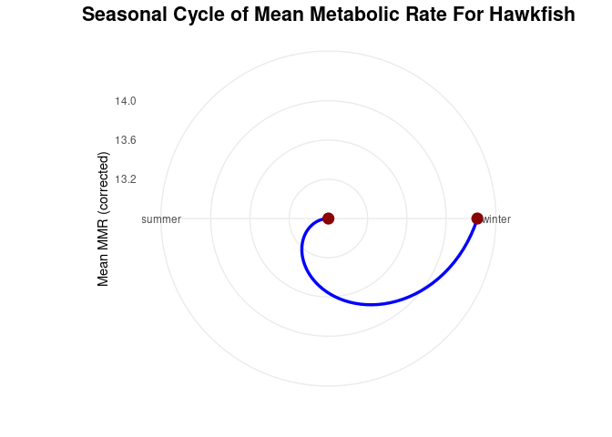
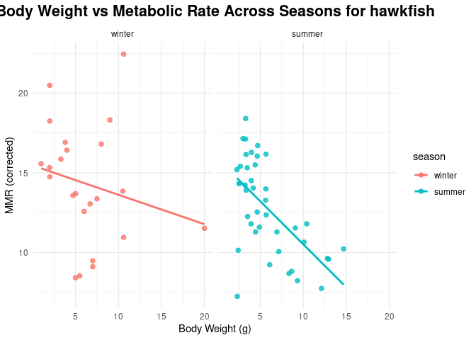

Project memo
================
MMTR

``` r
library(tidyverse)
library(broom)
library(viridisLite)
library(ggplot2)
```

## Data Clean Up Steps for Overall Data

### Step 1: Upload main dataset

``` r
heatwaves_coral_fish <- read_csv("../data/VanWert_etal_2023_hawkfish.csv")
```

    ## Rows: 75 Columns: 22
    ## ── Column specification ────────────────────────────────────────────────────────
    ## Delimiter: ","
    ## chr  (4): season, treatment_new, tank, chase_pre_v_post
    ## dbl (18): hawkfish_no, year, bw_g, tl_cm, sl_cm, mmr_corrected, smr_low10_al...
    ## 
    ## ℹ Use `spec()` to retrieve the full column specification for this data.
    ## ℹ Specify the column types or set `show_col_types = FALSE` to quiet this message.

``` r
glimpse(heatwaves_coral_fish)
```

    ## Rows: 75
    ## Columns: 22
    ## $ hawkfish_no            <dbl> 1, 2, 3, 4, 5, 6, 7, 8, 9, 10, 11, 12, 13, 14, …
    ## $ year                   <dbl> 2019, 2019, 2019, 2019, 2019, 2019, 2019, 2019,…
    ## $ season                 <chr> "winter", "winter", "winter", "winter", "winter…
    ## $ treatment_new          <chr> "31", "31", "31", "27", "27", "27", "27", "31",…
    ## $ bw_g                   <dbl> 6.00, 8.00, 9.00, 6.70, 10.50, 7.00, 4.00, 2.00…
    ## $ tank                   <chr> "S2", "S2", "S3", "S1", "S4", "S5", "S5", "S2",…
    ## $ tl_cm                  <dbl> 7.0, 8.5, 9.0, 7.2, 9.0, 7.1, 6.7, 4.5, 7.4, 5.…
    ## $ sl_cm                  <dbl> 6.1, 7.2, 7.4, 6.2, 7.2, 6.0, 5.9, 3.9, 6.1, 4.…
    ## $ chase_pre_v_post       <chr> "post", "post", "post", "post", "post", "post",…
    ## $ mmr_corrected          <dbl> 12.58, 16.81, 18.32, 13.05, 13.85, 9.48, 16.42,…
    ## $ smr_low10_all          <dbl> 2.71, 2.30, 2.53, NA, 1.52, 1.37, 1.78, NA, 2.1…
    ## $ aas_corrected          <dbl> 9.87, 14.50, 15.79, NA, 12.33, 8.11, 14.65, NA,…
    ## $ fas                    <dbl> 4.64, 7.30, 7.23, NA, 9.09, 6.91, 9.25, NA, 6.3…
    ## $ percent_bw_scallop_fed <dbl> 2, 2, 2, 2, 2, 2, 2, 2, 2, 2, 2, 2, 2, 2, 2, 2,…
    ## $ SDA_integrated         <dbl> 54.86, 48.24, 26.69, 18.58, 31.06, 31.38, 59.89…
    ## $ SDA_duration           <dbl> 31.5, 30.5, 26.5, 28.5, 28.5, 29.5, 34.5, 12.5,…
    ## $ peak_SDA_max           <dbl> 8.51, 5.95, 5.43, 3.07, 4.25, 3.90, 5.03, 9.09,…
    ## $ time_peak_SDA_max      <dbl> 0.0, 14.5, 7.5, 0.0, 15.5, 15.5, 19.5, 5.5, 23.…
    ## $ sda_coeff              <dbl> 1.20, 1.06, 0.59, 0.41, 0.68, 0.69, 1.32, 0.52,…
    ## $ tarr                   <dbl> NA, NA, NA, NA, NA, NA, NA, NA, NA, NA, NA, NA,…
    ## $ fhmax_peak             <dbl> NA, NA, NA, NA, NA, NA, NA, NA, NA, NA, NA, NA,…
    ## $ tpeak                  <dbl> NA, NA, NA, NA, NA, NA, NA, NA, NA, NA, NA, NA,…

### Step 2: Change Variable Names

``` r
heatwaves_coral_fish_clean <- heatwaves_coral_fish |>
  rename(wet_mass = bw_g,
         total_length = tl_cm,
         standard_length = sl_cm,
         max_metabolic_rate = mmr_corrected,
         standard_metabolic_rate = smr_low10_all,
         absolute_aerobic_scope = aas_corrected,
         factorial_aerobic_scope = fas,
         SDA_coeff = sda_coeff,
         temp_of_arrhythmia = tarr,
         peak_max_heart_rate = fhmax_peak,
         temp_at_max_heart_rate = tpeak)
```

## Plots

### Plot 1: Boxplot: Heatwave treatment vs. maximum metabolic rate (MMR)

``` r
heatwave_vs_mmr <- heatwaves_coral_fish_clean |>
  ggplot(aes(x = treatment_new, y = max_metabolic_rate)) +
  geom_boxplot(fill = "#6BAED6") +
  scale_x_discrete(labels = function(x) ifelse(x == "wild", "wild", paste0(x, "°C"))) +
  labs(
    title = "Maximum Metabolic Rate by Heatwave Treatment",
    subtitle = "“wild” is the control group (no heatwave)",
    x = "Treatment (Heatwave Temperature)",
    y = "Maximum Metabolic Rate (MMR)"
  )

# Save the plot
ggsave("fig_heatwave_boxplot.png", heatwave_vs_mmr, width = 7, height = 5)
```

    ## Warning: Removed 11 rows containing non-finite outside the scale range
    ## (`stat_boxplot()`).

### Plot 2: Scatter Plot: Treatment vs. post-feeding energy use, colored by season

``` r
temp_energy_season <- heatwaves_coral_fish_clean |>
  ggplot(aes(x = treatment_new, y = SDA_integrated, color = season)) +
  geom_point(alpha = 0.8, size = 3) +
  scale_x_discrete(labels = function(x) ifelse(x == "wild", "wild", paste0(x, "°C"))) +
  labs(
    title = "Temperature vs. SDA (by Season)",
    subtitle = "SDA stands for specific dynamic action, which measured digestive costs",
    x = "Temperature Treatment",
    y = "SDA Integrated"
  )

# Save the plot
ggsave("fig_temp_energy_season_scatterplot.png", temp_energy_season, width = 7, height = 5)
```

    ## Warning: Removed 20 rows containing missing values or values outside the scale range
    ## (`geom_point()`).

### Plot 3:Time graph, seasonal cycle of mettabolic rate

``` r
df <- read.csv("../data/VanWert_etal_2023_hawkfish.csv")
df$season <- factor(df$season, 
                    levels = c("winter", "spring", "summer", "fall"))


season_means <- df |>
  group_by(season) |>
  summarise(mean_mmr = mean(mmr_corrected, na.rm = TRUE))


ggplot(season_means, aes(x = season, y = mean_mmr, group = 1)) +
  geom_line(size = 1.2, color = "blue") +
  geom_point(size = 4, color = "darkred") +
  coord_polar() +
  theme_minimal() +
  labs(
    title = "Seasonal Cycle of Mean Metabolic Rate",
    x = "",
    y = "Mean MMR (corrected)"
  ) +
  theme(
    plot.title = element_text(size = 16, face = "bold", hjust = 0.5)
   
  )
```

    ## Warning: Using `size` aesthetic for lines was deprecated in ggplot2 3.4.0.
    ## ℹ Please use `linewidth` instead.
    ## This warning is displayed once every 8 hours.
    ## Call `lifecycle::last_lifecycle_warnings()` to see where this warning was
    ## generated.

<!-- --> \###
Plot 4 draft: Time faceted: Seasonal graph looking an body weight vs
metabolic rate

``` r
df <- read.csv("../data/VanWert_etal_2023_hawkfish.csv")

df$season <- factor(df$season, 
                    levels = c("winter", "spring", "summer", "fall"))

ggplot(df, aes(x = bw_g, y = mmr_corrected, color = season)) +
  geom_point(alpha = 0.8, size = 2) +
  geom_smooth(method = "lm", se = FALSE) +
  facet_wrap(~ season, nrow = 1) +
  theme_minimal() +
  labs(
    title = "Body Weight vs Metabolic Rate Across Seasons",
    x = "Body Weight (g)",
    y = "MMR (corrected)"
  ) +
  theme(
    plot.title = element_text(size = 16, face = "bold", hjust = 0.5)

  )
```

    ## `geom_smooth()` using formula = 'y ~ x'

    ## Warning: Removed 11 rows containing non-finite outside the scale range
    ## (`stat_smooth()`).

    ## Warning: Removed 11 rows containing missing values or values outside the scale range
    ## (`geom_point()`).

<!-- -->

### Plot 4:

#### Final Plot 1

### Plot 2: \_\_\_\_\_\_\_\_\_

### Plot 3: \_\_\_\_\_\_\_\_\_\_\_

Add more plot sections as needed. Each project should have at least 3
plots, but talk to me if you have fewer than 3.

### Plot 4: \_\_\_\_\_\_\_\_\_\_\_
