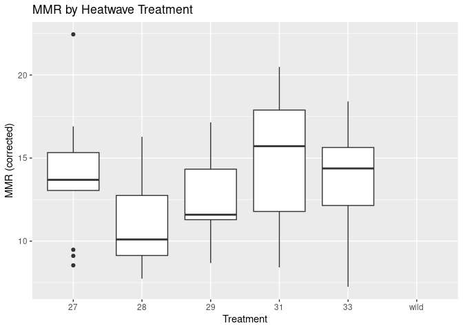
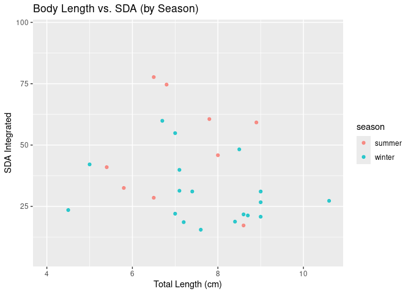
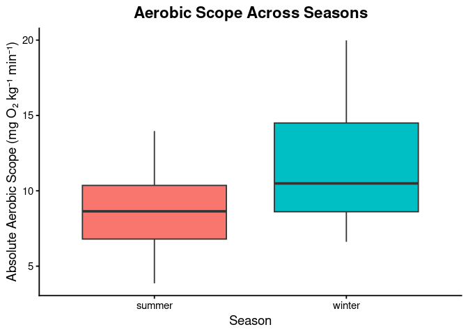

Project proposal
================
MMTR

``` r
library(tidyverse)
library(broom)
library(readxl)
```

## 1. Introduction

The study focused on the effect of heatwaves on coral reef fish. The
study was conducted by Van Wert et al. and was published on July 15,
2024. The Hawkfish were collected in Mo’orea, French Polynesia in 2019
during the winter and 2022 during the summer. They studied how marine
heatwaves impacted the performance and thermal tolerance of the arceye
hawkfish, which is a tropical predatory fish.

More specifically, the researchers used five treatments (27, 28, 29, 31,
or 33°C) for one week to test hawkfish’s acclimation ability, which they
measured by metabolic performance metrics, including maximum metabolic
rate (MMR), standard metabolic rate (SMR), and costs of digestion
(specific dynamic action, SDA), using custom-made respirometry chambers.
A subset of fish and wild fish were tested for thermal tolerance using
an acute cardiac thermal tolerance test.

This dataset contains 75 cases and 22 variables.

For this project, our research question focuses on the negative effects
of heatwaves on hawkfish to understand the greater effect of climate
change on marine populations. Some questions include:

1.  What threat do heatwaves pose to hawkfish?

2.  Does the season (summer vs winter) have any effect on the fish’s
    energy?

3.  What is the long-term impact of these heatwaves on the fish’s health
    and physiology?

4.  Will warming ocean temperatures affect the size of future hawkfish
    populations?

## 2. Data

The dataset including the following variables:

1.  `hawkfish_no` = unique fish ID

2.  `year` = year of fish collection and measurements

3.  `season` = Austral summer (summer) or Austral winter (winter)

4.  `treatment_new` = acclimation temperature; ‘wild’ indicates fish
    were not acclimated and were collected from the wild and immediately
    tested

5.  `bw_g` = wet mass of fish (units g)

6.  `tank` = fish tank ID during acclimation

7.  `tl_cm` = total length of fish (units cm)

8.  `sl_cm` = standard length of fish (units cm)

9.  `chase_pre_v_post` = whether exhaustive exercise chase occurred
    before (pre) or after (post) SMR measurements

10. `mmr_corrected` = body mass corrected maximum metabolic rate by
    universal metabolic scaling coefficient of 0.89 (units mg O2 kg-1
    min-1)

11. `smr_low10_all` = standard metabolic rate (units mg O2 kg-1 min-1)

12. `aas_corrected` = absolute aerobic scope (units mg O2 kg-1 min-1)

13. `fas` = factorial aerobic scope calculated as mmr/smr (unitless)

14. `percent_bw_scallop_fed` = percent of body weight scallop fed for
    SDA trial

15. `SDA_integrated` = integral of specific dynamic action (SDA) (units
    mg O2 kg-1)

16. `SDA_duration` = duration of specific dynamic action (SDA) (units
    hours)

17. `peak_SDA_max` = maximum metabolic oxygen consumption (MO2) reached
    during specific dynamic action (SDA) (units mg O2 kg-1 min-1)

18. `time_peak_SDA_max` = time at which peak_SDA_max occurred (units
    hours)

19. `sda_coeff` = specific dynamic action (SDA) coefficient (units %)

20. `tarr` = temperature of arrhythmia (units degC), only measured
    during winter tests

21. `fhmax_peak` = peak maximum heart rate (units beats per min), only
    measured during winter tests

22. `tpeak` = temperature at which fhmax_peak occurred (units degC),
    only measured during winter tests

``` r
heatwaves_coral_fish <- read_csv("../data/VanWert_etal_2023_hawkfish.csv")
```

    ## Rows: 75 Columns: 22
    ## ── Column specification ────────────────────────────────────────────────────────
    ## Delimiter: ","
    ## chr  (4): season, treatment_new, tank, chase_pre_v_post
    ## dbl (18): hawkfish_no, year, bw_g, tl_cm, sl_cm, mmr_corrected, smr_low10_al...
    ## 
    ## ℹ Use `spec()` to retrieve the full column specification for this data.
    ## ℹ Specify the column types or set `show_col_types = FALSE` to quiet this message.

``` r
glimpse(heatwaves_coral_fish)
```

    ## Rows: 75
    ## Columns: 22
    ## $ hawkfish_no            <dbl> 1, 2, 3, 4, 5, 6, 7, 8, 9, 10, 11, 12, 13, 14, …
    ## $ year                   <dbl> 2019, 2019, 2019, 2019, 2019, 2019, 2019, 2019,…
    ## $ season                 <chr> "winter", "winter", "winter", "winter", "winter…
    ## $ treatment_new          <chr> "31", "31", "31", "27", "27", "27", "27", "31",…
    ## $ bw_g                   <dbl> 6.00, 8.00, 9.00, 6.70, 10.50, 7.00, 4.00, 2.00…
    ## $ tank                   <chr> "S2", "S2", "S3", "S1", "S4", "S5", "S5", "S2",…
    ## $ tl_cm                  <dbl> 7.0, 8.5, 9.0, 7.2, 9.0, 7.1, 6.7, 4.5, 7.4, 5.…
    ## $ sl_cm                  <dbl> 6.1, 7.2, 7.4, 6.2, 7.2, 6.0, 5.9, 3.9, 6.1, 4.…
    ## $ chase_pre_v_post       <chr> "post", "post", "post", "post", "post", "post",…
    ## $ mmr_corrected          <dbl> 12.58, 16.81, 18.32, 13.05, 13.85, 9.48, 16.42,…
    ## $ smr_low10_all          <dbl> 2.71, 2.30, 2.53, NA, 1.52, 1.37, 1.78, NA, 2.1…
    ## $ aas_corrected          <dbl> 9.87, 14.50, 15.79, NA, 12.33, 8.11, 14.65, NA,…
    ## $ fas                    <dbl> 4.64, 7.30, 7.23, NA, 9.09, 6.91, 9.25, NA, 6.3…
    ## $ percent_bw_scallop_fed <dbl> 2, 2, 2, 2, 2, 2, 2, 2, 2, 2, 2, 2, 2, 2, 2, 2,…
    ## $ SDA_integrated         <dbl> 54.86, 48.24, 26.69, 18.58, 31.06, 31.38, 59.89…
    ## $ SDA_duration           <dbl> 31.5, 30.5, 26.5, 28.5, 28.5, 29.5, 34.5, 12.5,…
    ## $ peak_SDA_max           <dbl> 8.51, 5.95, 5.43, 3.07, 4.25, 3.90, 5.03, 9.09,…
    ## $ time_peak_SDA_max      <dbl> 0.0, 14.5, 7.5, 0.0, 15.5, 15.5, 19.5, 5.5, 23.…
    ## $ sda_coeff              <dbl> 1.20, 1.06, 0.59, 0.41, 0.68, 0.69, 1.32, 0.52,…
    ## $ tarr                   <dbl> NA, NA, NA, NA, NA, NA, NA, NA, NA, NA, NA, NA,…
    ## $ fhmax_peak             <dbl> NA, NA, NA, NA, NA, NA, NA, NA, NA, NA, NA, NA,…
    ## $ tpeak                  <dbl> NA, NA, NA, NA, NA, NA, NA, NA, NA, NA, NA, NA,…

## 3. Data analysis plan

- What variables will you visualize to explore your research questions?

Season: `season` = Austral summer (summer) or Austral winter (winter)

Temperature: `treatment_new` = acclimation temperature; ‘wild’ indicates
fish were not acclimated and were Mass of fish: bw_g = wet mass of fish
(units g)

Fish length: `tl_cm` = total length of fish (units cm)

Heart rate: `fhmax_peak` = peak maximum heart rate (units beats per
min), only measured during winter tests Metabolic rate

- Will there be any other data that you need to find to help with your
  research question?

Since our dataset only contains 75 observations, we think it will be
helpful if we can find some other data in water temperatures and the
amount or size of Hawkfish any other types of fish.

- The data visualization(s) that you believe will be useful in exploring
  your question(s). (You can update these later as you work on your
  project.)

Scatterplot of `mmr_corrected` vs `SDA_integrated` with points colored
by `treatment_new` — to see if heatwave affects energy use after
feeding.

Boxplot of `SDA_integrated` or `fas` by `season` to see if fish have
higher energy use in one season.

- Very preliminary exploratory data analysis, including some summary
  statistics and visualizations, along with some explanation on how they
  help you learn more about your data. (You can add to these later as
  you work on your project.)

The boxplot shows how metabolic rate (MMR) changes across heatwave
treatments, helping identify which temperatures lead to higher energy
use. The scatterplot shows how body size relates to energy use (SDA) and
whether this relationship differs by season, revealing seasonal patterns
in metabolism.

``` r
heatwaves_coral_fish |>
  summarise(
    mean_mmr   = mean(mmr_corrected, na.rm = TRUE),
    median_mmr = median(mmr_corrected, na.rm = TRUE),
    min_mmr    = min(mmr_corrected, na.rm = TRUE),
    max_mmr    = max(mmr_corrected, na.rm = TRUE),

    mean_smr   = mean(smr_low10_all, na.rm = TRUE),
    median_smr = median(smr_low10_all, na.rm = TRUE),
    min_smr    = min(smr_low10_all, na.rm = TRUE),
    max_smr    = max(smr_low10_all, na.rm = TRUE),

    mean_SDA   = mean(SDA_integrated, na.rm = TRUE),
    median_SDA = median(SDA_integrated, na.rm = TRUE),
    min_SDA    = min(SDA_integrated, na.rm = TRUE),
    max_SDA    = max(SDA_integrated, na.rm = TRUE),

    mean_bw    = mean(bw_g, na.rm = TRUE),
    mean_tl    = mean(tl_cm, na.rm = TRUE)
  )
```

    ## # A tibble: 1 × 14
    ##   mean_mmr median_mmr min_mmr max_mmr mean_smr median_smr min_smr max_smr
    ##      <dbl>      <dbl>   <dbl>   <dbl>    <dbl>      <dbl>   <dbl>   <dbl>
    ## 1     13.3       13.6    7.25    22.4     3.52       3.36    1.37    6.58
    ## # ℹ 6 more variables: mean_SDA <dbl>, median_SDA <dbl>, min_SDA <dbl>,
    ## #   max_SDA <dbl>, mean_bw <dbl>, mean_tl <dbl>

``` r
# 1) Boxplot: Heatwave treatment vs. maximum metabolic rate (MMR)
heatwaves_coral_fish |>
  ggplot(aes(x = treatment_new, y = mmr_corrected)) +
  geom_boxplot() +
  labs(
    title = "MMR by Heatwave Treatment",
    x = "Treatment",
    y = "MMR (corrected)"
  )
```

    ## Warning: Removed 11 rows containing non-finite outside the scale range
    ## (`stat_boxplot()`).

<!-- -->

``` r
# 2) Scatter: Body length vs. post-feeding energy use, colored by season
heatwaves_coral_fish |>
  ggplot(aes(x = tl_cm, y = SDA_integrated, color = season)) +
  geom_point(alpha = 0.8) +
  labs(
    title = "Body Length vs. SDA (by Season)",
    x = "Total Length (cm)",
    y = "SDA Integrated"
  )
```

    ## Warning: Removed 48 rows containing missing values or values outside the scale range
    ## (`geom_point()`).

<!-- -->

``` r
# 3) Boxplot: Aerobic Scope Across Seasons 
heatwaves_coral_fish |>
  ggplot(aes(x = season, y = aas_corrected, fill = season)) +
  geom_boxplot() +
  labs(
    title = "Aerobic Scope Across Seasons",
    x = "Season",
    y = "Absolute Aerobic Scope (mg O₂ kg⁻¹ min⁻¹)"
  ) +
  theme_classic(base_size = 14) +
  theme(
    legend.position = "none",
    plot.title = element_text(face = "bold", hjust = 0.5)
  )
```

    ## Warning: Removed 25 rows containing non-finite outside the scale range
    ## (`stat_boxplot()`).

<!-- -->
